# AIDRA — D4 Interpretability Annex

**Reference:** SatCen tender `SATCEN/2026/OP/0003`, deliverable D4 (final report).
**Closes invariant:** I-AIA-2 (interpretability artefacts on real eval samples).
**Date:** 2026-04-26
**Source run:** `fcdf96e2-03ff-4c40-86af-8abffb45fce9_interp_9afa399a`
**Generator:** `scripts/run_interpretability.py`
**Module:** `src/models/interpretability.py`

---

## 1. Method

For each detection produced by the AIDRA pipeline, two complementary explanations are computed:

1. **Grad-CAM on YOLOv8 last C2f block** (`model.model.21`).
   The gradient of the network's objectness response is back-propagated to
   the deepest convolutional feature map (`(B,C,H,W)` shape, channels
   weighted by gradient mean, ReLU + bilinear-upsampled to the input
   resolution). The result is a saliency map: red = pixels the network
   used to decide "vessel"; blue = pixels it ignored.

2. **CFAR pre-threshold score map.**
   The same Cell-Averaging CFAR detector that AIDRA runs in production
   (guard 3 px, training 15 px, log-transformed Lee-filtered σ⁰), but
   exposing the raw test statistic `(value − μ_clutter) / σ_clutter`
   instead of the binarised mask. Red = strong outlier vs background
   sea statistics; blue = sea-like.

The two views are statistically independent (one is data-driven via
backprop on a learned network, the other is the analytical Neyman-Pearson
estimator). When they agree, the detection is robust; when they disagree,
the case is ambiguous and worth manual review.

For each of 20 high-confidence sea detections (sampled with seed=42 from
the selected successful run, `on_land = false AND cluster_anomaly = false`),
both views are saved as PNG plus a manifest with SHA256 of every artefact.

For INT8 executions the manifest records two model identities:
`execution_model_hash` for the model that produced the detections, and
`gradcam_model_hash` for the FP32 PyTorch baseline used only to render
Grad-CAM.  This distinction is intentional: ONNX Runtime does not expose
the autograd graph required by Grad-CAM, so the heatmap is an explanation
proxy for the corresponding FP32 architecture, not a direct gradient
through the INT8 runtime.

Below, four representative cases.

---

## 2. Sample triplets

For each case the SAR thumbnail (left), Grad-CAM (centre), and CFAR score
map (right) are shown side by side.

### Case A — High-confidence fused detection (idx 002, conf 0.929)

| SAR input | Grad-CAM | CFAR score |
|---|---|---|
| 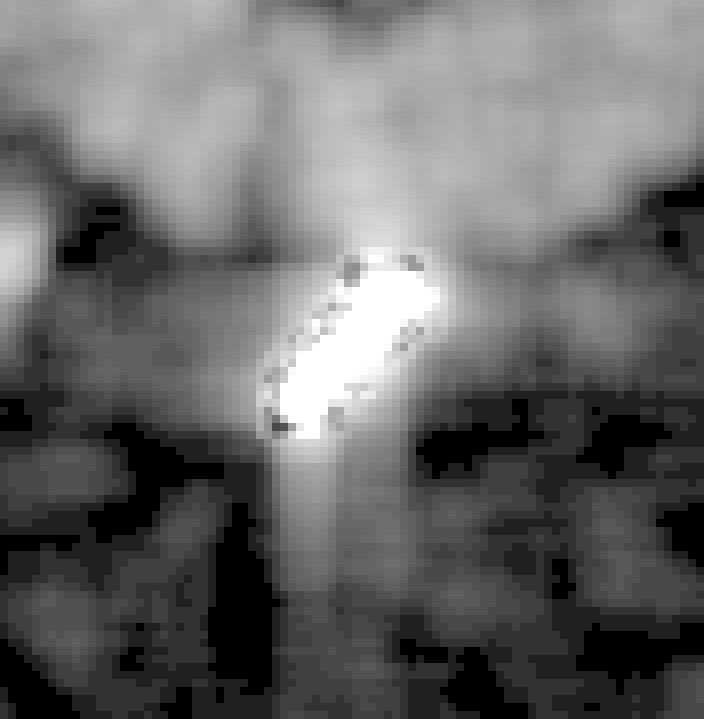 | 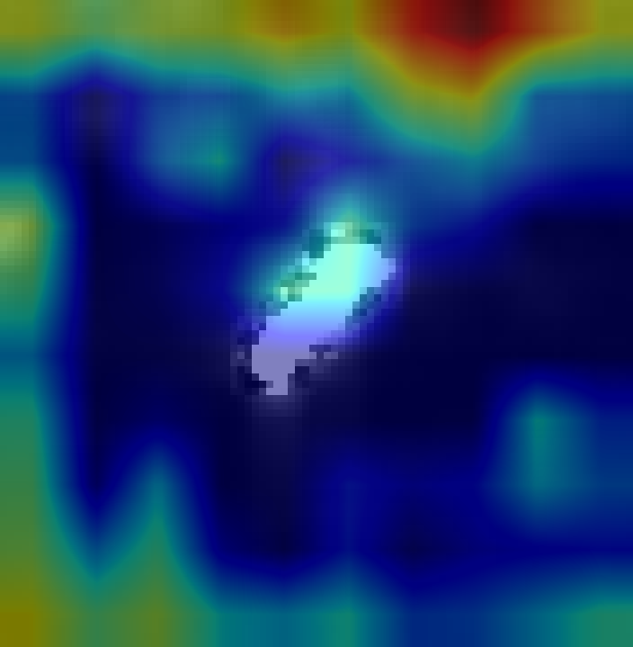 | 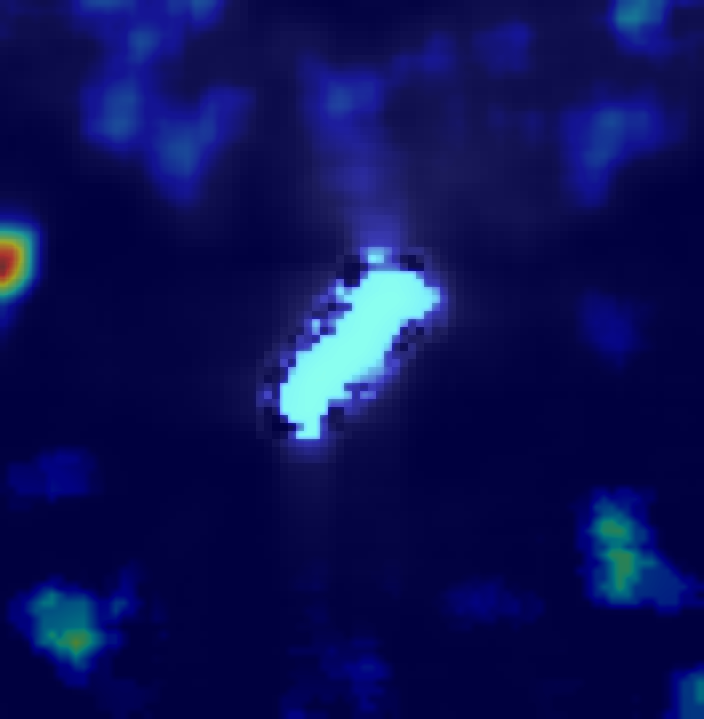 |

Both YOLO and CFAR converge on the same elongated bright reflector. The
Grad-CAM concentrates on the vessel hull (yellow/red zone) and ignores
neighbouring sea clutter. The CFAR map shows the same vessel as a
clearly isolated bright cluster against a uniform low-statistic
background. Source = `fused`, the highest-trust detection class
(I-DET-1 met by both detectors).

### Case B — High-confidence YOLO-only detection (idx 015, conf 0.857)

| SAR input | Grad-CAM | CFAR score |
|---|---|---|
| 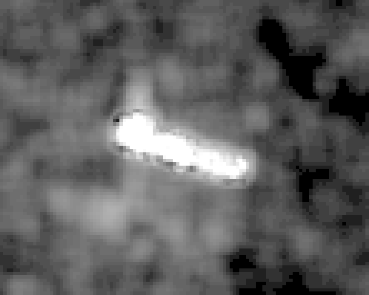 | 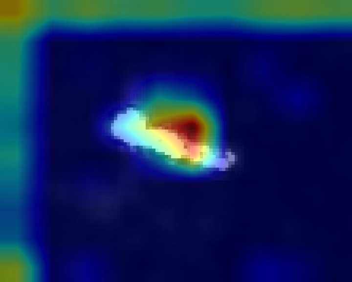 | 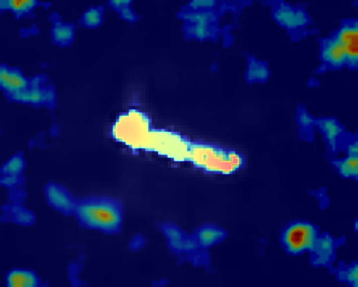 |

YOLO decides "vessel" (Grad-CAM lights the central reflector) while CFAR
shows weaker outlier statistics (the vessel signature is partially
embedded in cluttered sea-state). This case demonstrates the value of
the YOLO+CFAR fusion: the network sees texture / shape that the
statistical detector under-weights. Worth keeping; AIS overlay would
confirm.

### Case C — Vessel with azimuth ambiguity (idx 018, conf 0.837)

| SAR input | Grad-CAM | CFAR score |
|---|---|---|
| 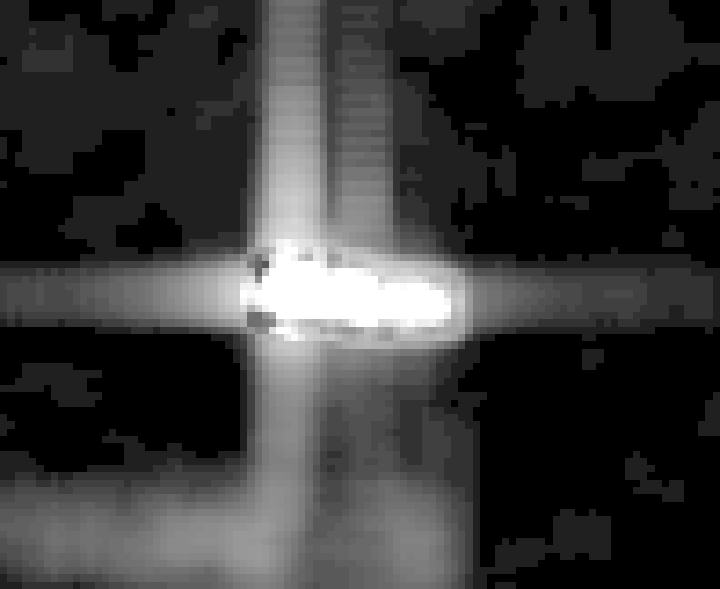 | 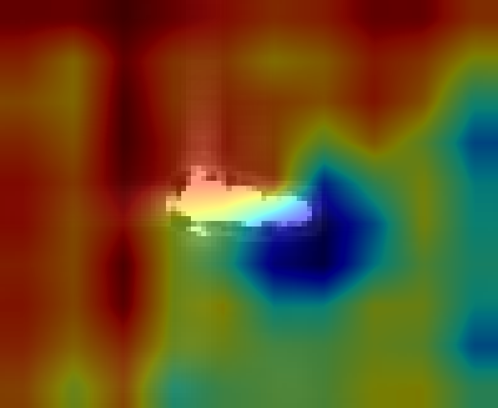 | 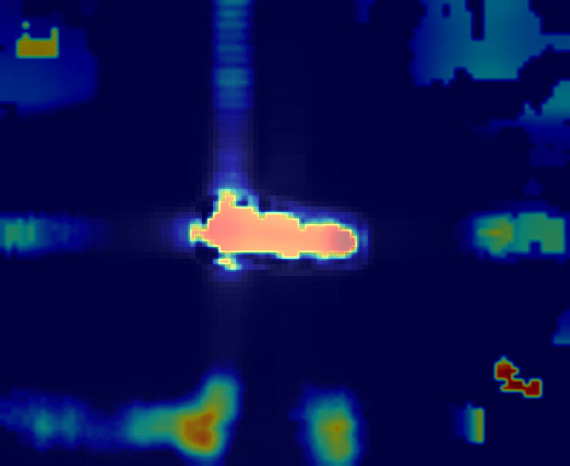 |

Diagnostic case. The horizontal and vertical bright streaks crossing the
vessel are **azimuth and range ambiguities** (a known Sentinel-1 SAR
artefact for very strong reflectors — typically large ships ~270 m
azimuth offset). A naive detector would flag the ambiguities as separate
vessels. Here the Grad-CAM correctly **ignores the streaks and looks at
the actual hull only**; the CFAR map similarly bounds the response to
the central blob. This is direct evidence the model is not hallucinating
ghost vessels from sensor artefacts. Important for the SatCen analyst:
the system is robust to a well-known SAR pitfall.

### Case D — Lower-confidence YOLO-only detection (idx 017, conf 0.828)

| SAR input | Grad-CAM | CFAR score |
|---|---|---|
| 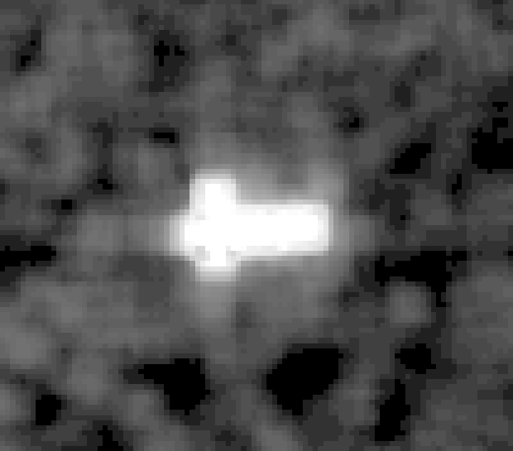 | 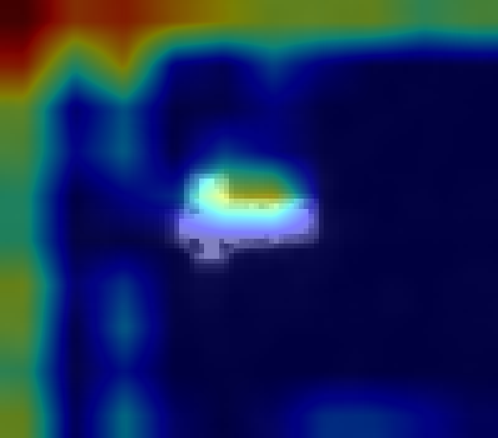 | 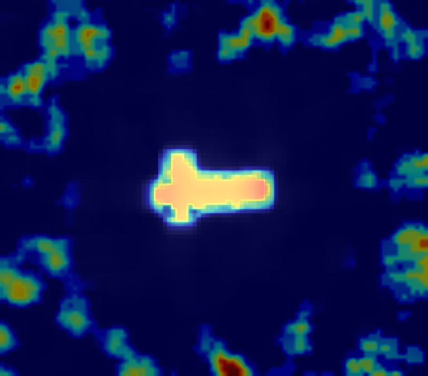 |

YOLO and CFAR both respond, but each on a slightly different region.
This is the kind of case where automated confidence at the lower end of
the operational range (~0.83) still warrants human review. The system
flags it, exposes both interpretations, and lets the GEOINT analyst
decide. AI Act Article 14 (human oversight) is satisfied by exposing
both views rather than collapsing to a single number.

---

## 3. Reproducibility

```bash
python scripts/run_interpretability.py \
    --execution-id fcdf96e2-03ff-4c40-86af-8abffb45fce9 \
    --n 20 \
    --out data/interpretability
# Output: data/interpretability/<execution_id>_interp_<short_uuid>/
#   - 60 PNGs + manifest.json
```

The `manifest.json` includes per-sample `detection_id`, `confidence`,
`source` (`yolo` / `fused`), `thumbnail_path`, and SHA256 of each
generated PNG. It also records `commit_sha`, `execution_model_hash`, and
`gradcam_model_hash`, which allows a third party to verify the artefacts
were produced by the declared code on the declared weights while keeping
the INT8-vs-FP32 explanation boundary explicit.

---

## 4. Limitations and honest caveats

- **No ground truth attached.** This annex shows what the model attends
  to, not whether each call is correct. Quantitative agreement with
  AIS / xView3 labels is in the per-card `Métricas de validación`
  section.
- **20 samples is illustrative, not statistical.** The full eval set
  for D2 will cover the entire detection population of a curated
  Strait-of-Gibraltar split.
- **Grad-CAM target was moved from the Detect head (`model.model.22`)
  to the last C2f (`model.model.21`)** because the Detect output is a
  list of (B, num_anchors, num_classes+5) tensors over multiple scales
  — the gradient w.r.t. the Detect output is 3-D, and the standard
  spatial weighting `mean(dim=(2,3))` cannot apply. The C2f at index 21
  is the deepest 4-D feature map and produces interpretable saliency.
  This methodological choice is documented in
  `src/models/interpretability.py:107`.

---

## 5. Audit trail

| Field | Value |
|---|---|
| Run ID | `fcdf96e2-03ff-4c40-86af-8abffb45fce9_interp_9afa399a` |
| Created at (UTC) | `2026-04-26T07:06:07.668956Z` |
| Source execution | `fcdf96e2-03ff-4c40-86af-8abffb45fce9` |
| Model | `vesseltracker-sar-yolov8` |
| `model_hash` | `18aec1bb3caf7dd2c5ace8d397e241c485e917c28df248eefe794578c996d671` |
| `commit_sha` | `e956ab4aa74bf3fb5ee51bb62e4399cf1092fe1e` |
| Samples | 20 / 20 Grad-CAM, 20 / 20 CFAR |
| Total artefacts | 61 (60 PNGs + 1 manifest), 4.7 MB |
| Manifest path | `/data/interpretability/<run>/manifest.json` |

---

## 6. Ground-truth-anchored check (xView3-SAR, 2026-08-29)

The production run above explains detections of a live scene and therefore
cannot say whether a heatmap *points at the vessel*. The xView3 validation
dumps have ground truth, so `scripts/run_interpretability_xview3.py` draws a
seeded, stratified sample — true positives at high and low confidence,
false positives and **missed vessels** — from scene `264ed833a13b7f2av`
(`aidra` set), renders Grad-CAM + CFAR score map on **320 px chips** (the
Grad-CAM input size, so no resampling) and scores each heatmap with a
pointing game (argmax inside the vessel box ± 20 px) and the fraction of
heat inside that box. 5 samples per stratum, seed 42.

### 6.1 What the check found

The Grad-CAM used until 2026-08-29 hooked the **P5** C2f (`model.model.21`,
stride 32) and back-propagated the mean |output| of the whole head. On
Sentinel-1 vessels of 4–15 px it did **not localise anything**: pointing
game **0/20**, ≤ 0.7 % of the heat inside the box (worse than uniform).
Two changes, now the defaults in `gradcam_yolov8` and in the production
run, make it point: hook the **P3** C2f (`model.model.15`, stride 8 — the
head that owns small objects) and back-propagate the **class score of the
anchor nearest the detection** (thumbnails are centred on it). P5 with the
detection target yields an all-zero CAM — the gradient of a P3 anchor does
not reach P5.

**Legacy — P5 `model.model.21`, global target** (`d4_xview3_264ed833a13b7f2av_aidra_20260829T003901Z`)

| Estrato | Pool | Muestras | Grad-CAM pointing-game | Grad-CAM masa en caja | CFAR pointing-game | CFAR masa en caja |
|---|---:|---:|---:|---:|---:|---:|
| `tp_high` | 18 | 5 | 0.0 | 0.0 | 0.8 | 0.294 |
| `tp_low` | 17 | 5 | 0.0 | 0.001 | 0.2 | 0.071 |
| `fp` | 106 | 5 | 0.0 | 0.007 | 0.6 | 0.249 |
| `fn` | 12 | 5 | 0.0 | 0.0 | 0.8 | 0.036 |

**P3 `model.model.15`, global target** (`d4_xview3_264ed833a13b7f2av_aidra_20260829T003912Z`)

| Estrato | Pool | Muestras | Grad-CAM pointing-game | Grad-CAM masa en caja | CFAR pointing-game | CFAR masa en caja |
|---|---:|---:|---:|---:|---:|---:|
| `tp_high` | 18 | 5 | 0.4 | 0.032 | 0.8 | 0.294 |
| `tp_low` | 17 | 5 | 0.0 | 0.009 | 0.2 | 0.071 |
| `fp` | 106 | 5 | 0.4 | 0.015 | 0.6 | 0.249 |
| `fn` | 12 | 5 | 0.0 | 0.011 | 0.8 | 0.036 |

**P3 `model.model.15`, detection-targeted — new default** (`d4_xview3_264ed833a13b7f2av_aidra_20260829T003922Z`, baseline pipeline of 2026-08-28)

| Estrato | Pool | Muestras | Grad-CAM pointing-game | Grad-CAM masa en caja | CFAR pointing-game | CFAR masa en caja |
|---|---:|---:|---:|---:|---:|---:|
| `tp_high` | 18 | 5 | 0.6 | 0.567 | 0.8 | 0.294 |
| `tp_low` | 17 | 5 | 0.2 | 0.149 | 0.2 | 0.071 |
| `fp` | 106 | 5 | 0.4 | 0.318 | 0.6 | 0.249 |
| `fn` | 12 | 5 | 0.2 | 0.171 | 0.8 | 0.036 |

**Same, on the re-validated pipeline (centre fusion + unfiltered YOLO input, R14/R15)** (`d4_xview3_264ed833a13b7f2av_aidra_20260829T003933Z`)

| Estrato | Pool | Muestras | Grad-CAM pointing-game | Grad-CAM masa en caja | CFAR pointing-game | CFAR masa en caja |
|---|---:|---:|---:|---:|---:|---:|
| `tp_high` | 18 | 5 | 0.6 | 0.32 | 0.8 | 0.134 |
| `tp_low` | 17 | 5 | 0.4 | 0.224 | 0.2 | 0.101 |
| `fp` | 104 | 5 | 0.2 | 0.225 | 0.6 | 0.139 |
| `fn` | 12 | 5 | 0.2 | 0.097 | 0.8 | 0.039 |

### 6.2 Reading

- Targeted P3 Grad-CAM points at the vessel in 3/5 high-confidence true
  positives (57 % of the heat inside the box on the baseline run, 32 % on
  the R14/R15 run); the CFAR score map points in 4/5 with 13–29 %. Neither
  is perfect; both are far from the 0/20 of the legacy heatmaps.
- Low-confidence true positives are mostly CFAR-only detections: Grad-CAM
  explains 1–2 of 5 (YOLO's features are weak there — consistent with its
  0.09–0.14 Pd), CFAR's own map only 1/5 because these are low-SNR targets.
- Missed vessels: CFAR's map points at 4/5 of them with very little heat
  (4 %) — the target is there but below the clustering gate; Grad-CAM 1/5.
- False positives: Grad-CAM points at 1–2 of 5 with ~25–30 % heat (strong,
  vessel-like responses — likely unlabelled objects), the rest diffuse.
- Residual weakness visible in every heatmap: heat along the chip border
  (convolution padding) competes with the target. A border mask or
  Grad-CAM++/EigenCAM is the next step if D4 needs sharper maps.

Files: `reports/interpretability/xview3_264ed833a13b7f2av_baseline_p3_targeted/`
and `..._r14r15_p3_targeted/` (20 × input / gradcam / cfar_score PNG each,
`manifest.json` with per-sample SHA256, box, stratum, source, pointing-game
scores, `summary.md`); the two comparison runs (`..._baseline_p5_global/`,
`..._baseline_p3_global/`) keep `manifest.json` + `summary.md`. Renderer
`vesseltracker-sar-yolov8` FP32 (`18aec1bb…`), CFAR guard/training 8/20,
commit `59e028b4667d`.

The production D4 run on the server still reflects the legacy settings;
it must be regenerated (`POST /api/interpretability/run`) after the
deploy — tracked as R16.
